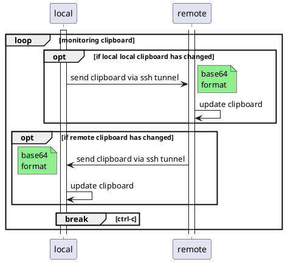
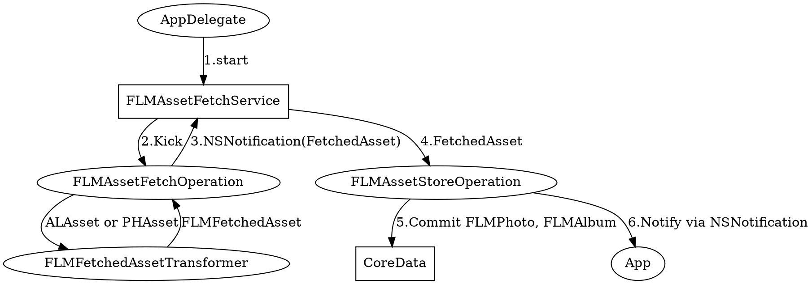

# playground

hoge

https://raw.githubusercontent.com%2FTLmaK0%2Fgravizo%2Fmaster%2FREADME.md)
https://raw.githubusercontent.com/TLmaK0/gravizo/master/README.md

 

custom_mark13
@startuml;
actor User;
participant "First Class" as A;
participant "Second Class" as B;
participant "Last Class" as C;
User -> A: DoWork;
activate A;
A -> B: Create Request;
activate B;
B -> C: DoWork;
activate C;
C -> B: WorkDone;
destroy C;
B -> A: Request Created;
deactivate B;
A -> User: Done;
deactivate A;
@enduml
custom_mark13

